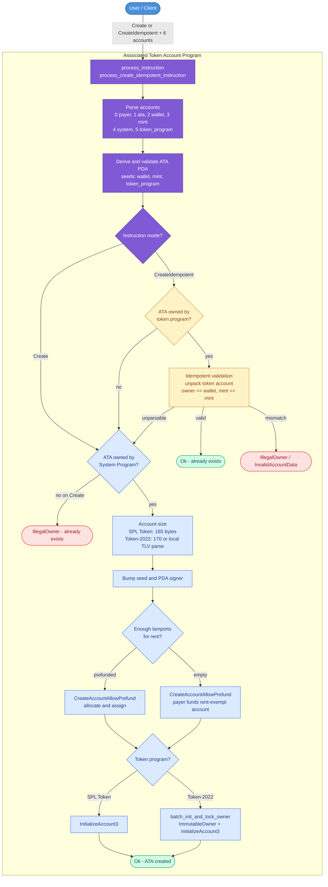
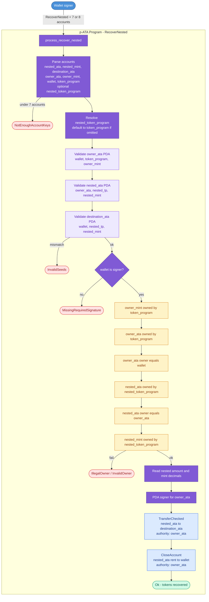

# Architecture diagrams

Mermaid source for the p-ATA instruction flows. These diagrams are also embedded in [README.md](README.md).

---

## Create / CreateIdempotent


---

## RecoverNested — account topology

```
                         ┌───────────────┐
                         │    wallet     │  (signer)
                         └───┬───────┬───┘
                             │       │
                             ▼       ▼
                  ┌─────────────┐ ┌─────────────┐
   PDA(wallet,    │  owner_ata  │ │ destination │  PDA(wallet,
      owner_mint) │  (mint A)   │ │  (mint B)   │      nested_mint)
                  └─────┬───────┘ └─────────────┘
                        │              ▲
                        ▼              │
                  ┌────────────┐  transfer_checked
 PDA(owner_ata,   │ nested_ata │───────┘
     nested_mint) │  (mint B)  │  all tokens
                  └────────────┘
                        │
                  close_account
                        │
                  rent ──▶ wallet
```

---

## RecoverNested — instruction flow


