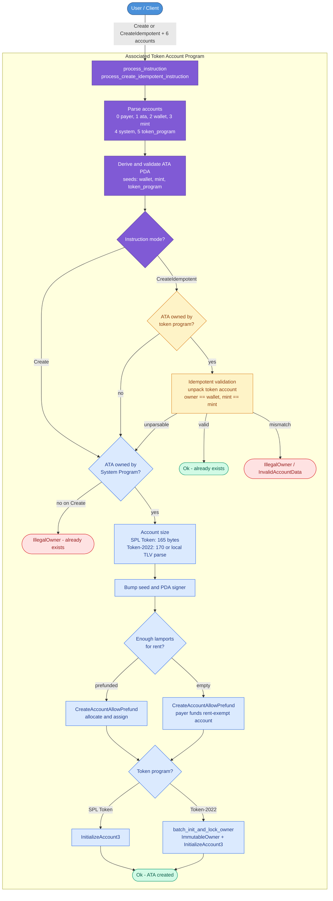
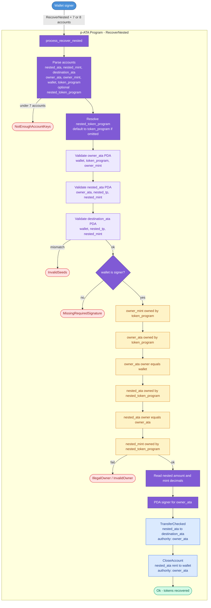

# pinocchio-associated-token-account-program (p-ATA)

A Pinocchio-based reimplementation of the [SPL Associated Token Account program](https://github.com/solana-program/associated-token-account), optimized for lower compute unit (CU) usage. Following the same approach as [p-token](https://github.com/solana-program/token/tree/main/pinocchio), p-ATA replaces `solana-program` with [Pinocchio](https://github.com/anza-xyz/pinocchio) to reduce overhead while preserving instruction and account layout compatibility.

## Overview

- `no_std` on-chain program
- Compatible instruction discriminators and account ordering with SPL ATA
- Minimized CU usage through constant short-circuits, local TLV parsing, and batched CPIs
- Mollusk-based tests and compute unit benchmarks

| Instruction | Discriminator |
|---|---|
| `Create` | `[]` / `[0]`  |
| `CreateIdempotent` | `[1]`  |
| `RecoverNested` | `[2]` |

## What is an ATA?

An Associated Token Account (ATA) is a deterministic token account derived as a PDA. For each unique triple of `(wallet, mint, token_program)` there is exactly one ATA address.

The ATA program does not implement token logic itself. It derives the address, allocates the account, assigns ownership to the token program, and initializes the token account via CPI. All subsequent token operations (transfer, burn, etc.) are handled by SPL Token or Token-2022.

The `token_program` seed is how ATAs are segregated between SPL Token and Token-2022 — the same `(wallet, mint)` pair produces different ATA addresses depending on which token program is used.

### Deriving an ATA address

```rust
Address::derive_program_address(
    &[
        wallet.as_ref(),
        mint.as_ref(),
        token_program.as_ref(),
    ],
    ata_program_id,
)
```

## Project structure

```
P-ATA/
├── program/                        # On-chain program
│   ├── src/
│   │   ├── lib.rs                  # Entrypoint + instruction dispatch
│   │   ├── create_idempotent.rs    # Create / CreateIdempotent handler
│   │   └── batch.rs                # Batched CPI for Token-2022 init
│   ├── tests/mollusk.rs            # Integration tests
│   └── benches/
│       ├── compute_units.rs        # CU benchmark harness
│       └── compute_units.md        # Benchmark results
└── interface/                      # Client interface (stub)
```

## Instructions

### Create / CreateIdempotent

Creates an associated token account for a `(wallet, mint, token_program)` triple. `Create` errors if the account already exists. `CreateIdempotent` returns `Ok(())` when a valid ATA is already present.

#### Accounts

| Index | Account | Signer | Writable | Description |
|---|---|---|---|---|
| 0 | `payer` | yes | yes | Funding account (system-owned; pays rent if needed) |
| 1 | `associated_token_account` | no | yes | The ATA PDA to create |
| 2 | `wallet` | no | no | Wallet that will own the token account |
| 3 | `mint` | no | no | Token mint |
| 4 | `system_program` | no | no | System program |
| 5 | `token_program` | no | no | SPL Token or Token-2022 program |

#### Flow



#### Account size resolution

| Token program | Condition | Size |
|---|---|---|
| SPL Token | always | 165 bytes (`Account::BASE_LEN`) |
| Token-2022 | mint has no extensions |(165 + account type + ImmutableOwner TLV) |
| Token-2022 | mint has extensions | Local TLV parse of mint extensions → `try_calculate_account_len` (no CPI) |

#### Account creation

`CreateAccountAllowPrefund` handles both prefunded and empty accounts in a single path:

- If the ATA already holds enough lamports for rent → allocate and assign via `invoke_signed`
- Otherwise → the payer funds a new rent-exempt account

#### Initialization

- **SPL Token**: single `InitializeAccount3` CPI
- **Token-2022**: `batch_init_and_lock_owner` — `InitializeImmutableOwner` + `InitializeAccount3` serialized into one batched CPI via `invoke_unchecked`

### RecoverNested

Recovers tokens stuck in a nested ATA — an ATA that was mistakenly created with another ATA address as the wallet/owner seed. Because nested ATAs are PDAs, the tokens would be permanently inaccessible without this instruction.

The program signs for the owner ATA (via its PDA seeds) to transfer all tokens to the wallet's correct ATA and close the nested account, returning rent to the wallet.

```
                         ┌───────────────┐
                         │    wallet     │  (signer)
                         └───┬───────┬───┘
                             │       │
                             ▼       ▼
                  ┌─────────────┐ ┌─────────────┐
   PDA(wallet,    │  owner_ata  │ │ destination │  PDA(wallet,
      owner_mint) │  (mint A)   │ │  (mint B)   │      nested_mint)
                  └─────┬───────┘ └─────────────┘
                        │              ▲
                        ▼              │
                  ┌────────────┐  transfer_checked
 PDA(owner_ata,   │ nested_ata │───────┘
     nested_mint) │  (mint B)  │  all tokens
                  └────────────┘
                        │
                  close_account
                        │
                  rent ──▶ wallet
```

#### Accounts

| Index | Account | Signer | Writable | Description |
|---|---|---|---|---|
| 0 | `nested_ata` | no | yes | Nested ATA (owned by `owner_ata`) |
| 1 | `nested_mint` | no | no | Mint of the nested ATA |
| 2 | `destination_ata` | no | yes | Wallet's correct ATA for the nested mint |
| 3 | `owner_ata` | no | no | Outer ATA (owned by token program, owner = wallet) |
| 4 | `owner_mint` | no | no | Mint of the owner ATA |
| 5 | `wallet` | yes | yes | Wallet signer; receives rent from close |
| 6 | `token_program` | no | no | Token program for the owner mint |
| 7 | `nested_token_program` | no | no | Optional; defaults to account 6 if omitted |

#### Flow



## Compute unit benchmarks

Benchmarks are run via the [Mollusk](https://github.com/anza-xyz/mollusk) compute unit bencher. Legacy ATA and official p-ATA numbers are from [SIMD #543](https://github.com/solana-foundation/solana-improvement-documents/discussions/543).

### CreateIdempotent

| Scenario | Legacy ATA | Official p-ATA | **p-ATA (ours)** | Reduction vs legacy |
|---|---|---|---|---|
| New account, SPL Token | 22,940 | 4,171 | **3,490** | −84.8% |
| Existing account, SPL Token | 3,710 | 548 | 927 | −75.0% |
| New account, Token-2022 | 15,474 | 5,496 | **5,169** | −66.3% |
| Existing account, Token-2022 | 8,210 | 1,634 | **566** | −93.1% |

### Highlights

- **Create (new, SPL Token)**: 840 CU cheaper than official p-ATA — constant account length, stack arrays, no CPI for sizing
- **Create (new, Token-2022)**: 327 CU cheaper than official p-ATA — local TLV parsing replaces the `GetAccountDataSize` CPI
- **Idempotent existing**: CU is dominated by `derive_program_address` bump iteration, which is data-dependent. SPL Token idempotent (927) is higher than official (548) due to a less favorable bump, not slower code. Token-2022 idempotent (566) is lower for the same reason

